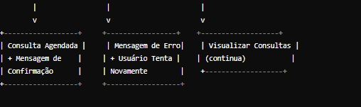

#### **Projeto:**

Sistema Web de Gerenciamento de Consultas Médicas

### **Descrição do Projeto:**

Site de Gerenciamento de consultas médicas onde usuários serão cadastrados e poderão agendar sua consulta com médicos especializados.

### **Elaboração do Escopo e Objetivos do Projeto:**

- **Escopo:**
    
    Este sistema de gerenciamento é uma aplicação web que permitirá o cadastro e a consulta de usuários, que irão ou que agendaram uma consulta médica. Também a busca e visualização de informações detalhadas do usuário (por exemplo medicamentos que ele tem alergia), para que o trabalho seja mais eficiente e eficaz. Utilizando uma filtragem, o aplicativo fornecerá dados sobre a consulta do dia ou da semana.
    
- **Objetivos:**
    - **Específicos:**
        
        Eficiência e Eficácia - Facilitar o processo e o controle de consultas médicas.
        
        Cadastro de Pacientes - O sistema consegue cadastrar usuários, com informações básicas (cpf, nome, telefone), para quando o paciente agendar uma consulta novamente o histórico médico já estará registrado 
        
        **Agendamento de Consultas: -** Permitir que os usuários agendem, editem e cancelem consultas médicas com facilidade.
        
        **Filtragem de Dados:** Fornecer uma filtragem para que os administradores possam visualizar consultas do dia ou da semana.
        
    - **Mensuráveis:**
        
        **Tempo de Processamento:** Tempo médio para agendar e gerenciar consultas.
        
        **Tempo de Processamento:** Tempo médio para agendar e gerenciar consultas.
        
    - **Atingíveis:**
        
        **Tecnologia Adequada:** Utilização de tecnologias e ferramentas que garantam a estabilidade e segurança do sistema.
        
    - **Relevantes:**
        
        **Aumento da Produtividade:** Permitir que médicos e administradores sejam mais produtivos e eficientes em suas funções diárias.
        
        **Melhoria na Gestão de Consultas:** Reduzir erros humanos e melhorar a organização no agendamento e controle de consultas.
        

### **Planejamento do Projeto:**

- **Cronograma:**

| Etapa | Descrição | Tempo Estimado |
| --- | --- | --- |
| Planejamento | Levantamento de requisitos, escopo, diagramas, objetivos e recursos | 5 dias |
| Configuração do Ambiente e Design | Configuração do ambiente de desenvolvimento, criação de models e controllers | 4 dias |
| Codificação | Codificação do projeto (PHP Laravel) - Implementação de funcionalidades, views, e integração | 10 dias |
| Testes e Ajustes | Testes funcionais, integração, correção de bugs | 5 dias |
| Revisão e Documentação | Revisão final, documentação técnica e de usuário | 3 dias |
| Deployment | Implantação no ambiente de produção e verificação | 2 dias |
- **Recursos:**
    
    **Programadores:** Especialistas em desenvolvimento frontend e backend.
    
    **Designer:** Responsável pela experiência do usuário e design da interface, garantindo que a aplicação seja intuitiva e visualmente atraente.
    
    **Servidor Web:** Hospedagem para a aplicação web
    
    **Banco de Dados:** Onde os dados do sistema são armazenados e gerenciados (PostgreSQL)
    
    **Ferramentas de Desenvolvimento:**  Visual Studio Code, Git, GitHub, Notion, ChatGpt
    
    **Ferramentas de Prototipagem:**  Figma
    
    **Ferramentas para criação de Diagramas:**  Draw.io
    
    **Linguagem e Framework:** Php e Laravel
    

### **Análise de Riscos:**

**Risco 1:** Atrasos no desenvolvimento devido a mudanças nos requisitos ou problemas técnicos.

**Solução:** Planejamento detalhado e flexível, comunicação constante com a equipe e gerenciamento ágil. Desenvolvimento de Sprints ao longo da semana

### **Desenvolvimento:**

**Diagrama de Desenvolvimento**

Diagrama de Classe

Diagrama de Fluxo

